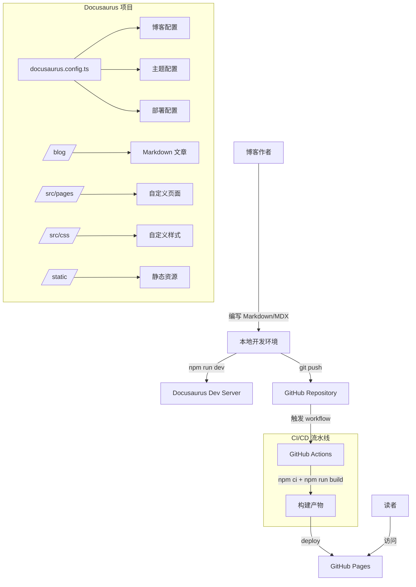

# 设计文档

## 概述

本设计描述了一个基于 Docusaurus 框架的 AI 技术博客系统。该系统使用 Docusaurus 作为静态站点生成器，通过 GitHub Actions CI/CD 流水线自动部署到 GitHub Pages。博客以中文为主要语言，专注于 AI 技术内容的撰写与分享。

核心设计决策：
- 使用 Docusaurus 3.x（最新稳定版），基于 React 和 MDX
- 采用 `classic` 预设，包含博客、文档和页面功能
- 使用 GitHub Actions + `actions/deploy-pages` 实现自动部署
- 通过自定义 CSS 优化中文排版体验

## 架构



## 组件与接口

### 1. 项目结构

```
ai-blog/
├── blog/                          # 博客文章目录
│   ├── 2024-01-01-welcome.md      # 示例文章
│   └── authors.yml                # 作者信息
├── src/
│   ├── css/
│   │   └── custom.css             # 自定义样式（中文排版）
│   └── pages/
│       └── index.tsx              # 首页组件
├── static/
│   └── img/                       # 静态图片资源
├── .github/
│   └── workflows/
│       ├── deploy.yml             # 部署工作流
│       └── ci.yml                 # PR 构建验证工作流
├── docusaurus.config.ts           # Docusaurus 主配置
├── sidebars.ts                    # 侧边栏配置
├── package.json                   # 项目依赖和脚本
└── tsconfig.json                  # TypeScript 配置
```

### 2. Docusaurus 配置（docusaurus.config.ts）

核心配置项：

```typescript
import type { Config } from '@docusaurus/types';
import type * as Preset from '@docusaurus/preset-classic';

const config: Config = {
  title: 'AI 技术博客',
  tagline: '探索人工智能的无限可能',
  favicon: 'img/favicon.ico',
  url: 'https://<username>.github.io',
  baseUrl: '/<repo-name>/',
  organizationName: '<username>',
  projectName: '<repo-name>',
  trailingSlash: false,
  i18n: {
    defaultLocale: 'zh-Hans',
    locales: ['zh-Hans'],
  },
  presets: [
    [
      'classic',
      {
        blog: {
          showReadingTime: true,
          blogSidebarTitle: '最新文章',
          blogSidebarCount: 'ALL',
          tagsBasePath: 'tags',
        },
        theme: {
          customCss: './src/css/custom.css',
        },
      } satisfies Preset.Options,
    ],
  ],
  themeConfig: {
    navbar: {
      title: 'AI 技术博客',
      items: [
        { to: '/blog', label: '博客', position: 'left' },
        { to: '/blog/archive', label: '归档', position: 'left' },
        { to: '/about', label: '关于', position: 'left' },
      ],
    },
    colorMode: {
      defaultMode: 'light',
      respectPrefersColorScheme: true,
    },
  } satisfies Preset.ThemeConfig,
};

export default config;
```

### 3. 导航系统

导航栏包含以下链接：
- **博客**：指向 `/blog`，展示文章列表
- **归档**：指向 `/blog/archive`，按时间归档
- **关于**：指向 `/about`，作者和博客介绍页

### 4. 中文排版样式（custom.css）

```css
:root {
  --ifm-font-family-base: -apple-system, BlinkMacSystemFont, 'Segoe UI',
    'PingFang SC', 'Hiragino Sans GB', 'Microsoft YaHei', 'Helvetica Neue',
    Helvetica, Arial, sans-serif;
  --ifm-heading-font-family: var(--ifm-font-family-base);
  --ifm-line-height-base: 1.8;
  --ifm-leading: 1.2rem;
}

.markdown p {
  margin-bottom: 1.2em;
  line-height: 1.8;
}

.markdown h1,
.markdown h2,
.markdown h3 {
  margin-top: 1.6em;
}
```

### 5. GitHub Actions 部署工作流（deploy.yml）

```yaml
name: Deploy to GitHub Pages

on:
  push:
    branches: [main]

permissions:
  contents: read
  pages: write
  id-token: write

concurrency:
  group: 'pages'
  cancel-in-progress: false

jobs:
  build:
    runs-on: ubuntu-latest
    steps:
      - uses: actions/checkout@v4
      - uses: actions/setup-node@v4
        with:
          node-version: 20
          cache: npm
      - run: npm ci
      - run: npm run build
      - uses: actions/upload-pages-artifact@v3
        with:
          path: build

  deploy:
    needs: build
    runs-on: ubuntu-latest
    environment:
      name: github-pages
      url: ${{ steps.deployment.outputs.page_url }}
    steps:
      - id: deployment
        uses: actions/deploy-pages@v4
```

### 6. PR 构建验证工作流（ci.yml）

```yaml
name: CI Build Check

on:
  pull_request:
    branches: [main]

jobs:
  build:
    runs-on: ubuntu-latest
    steps:
      - uses: actions/checkout@v4
      - uses: actions/setup-node@v4
        with:
          node-version: 20
          cache: npm
      - run: npm ci
      - run: npm run build
```

### 7. 博客文章模板

文章前置元数据格式：

```markdown
---
title: 文章标题
slug: article-slug
authors: [author-name]
tags: [机器学习, 深度学习]
date: 2024-01-01
---

文章摘要内容，会显示在列表页。

<!-- truncate -->

正文内容...
```

### 8. 示例文章内容规范

示例文章需要展示以下 Markdown/MDX 功能：
- 代码块（含语法高亮）
- 图片引用
- KaTeX 数学公式（需安装 `remark-math` 和 `rehype-katex` 插件）
- 标签使用

## 数据模型

### 博客文章元数据

| 字段 | 类型 | 必填 | 说明 |
|------|------|------|------|
| title | string | 是 | 文章标题 |
| slug | string | 否 | URL 路径标识，默认从文件名生成 |
| authors | string[] | 是 | 作者列表，引用 authors.yml |
| tags | string[] | 是 | 标签列表 |
| date | string | 是 | 发布日期，格式 YYYY-MM-DD |
| description | string | 否 | 文章描述，用于 SEO |
| image | string | 否 | 封面图片路径 |

### 作者信息（authors.yml）

| 字段 | 类型 | 必填 | 说明 |
|------|------|------|------|
| name | string | 是 | 作者名称 |
| title | string | 否 | 作者头衔 |
| url | string | 否 | 作者主页链接 |
| image_url | string | 否 | 作者头像 URL |

### 预设标签

| 标签 | 说明 |
|------|------|
| 机器学习 | Machine Learning 相关内容 |
| 深度学习 | Deep Learning 相关内容 |
| 自然语言处理 | NLP 相关内容 |
| 计算机视觉 | Computer Vision 相关内容 |
| 大语言模型 | LLM 相关内容 |


## 正确性属性

*正确性属性是指在系统所有有效执行中都应保持为真的特征或行为——本质上是关于系统应该做什么的形式化陈述。属性作为人类可读规范与机器可验证正确性保证之间的桥梁。*

本项目主要是一个静态站点配置项目，大部分验收标准属于配置验证（示例测试），只有少数涉及通用行为属性。

### Property 1: 文章列表按时间倒序排列

*For any* 包含多篇博客文章的博客系统，文章列表页面中每篇文章的发布日期应大于或等于其后一篇文章的发布日期。

**Validates: Requirements 2.1**

### Property 2: 标签筛选返回正确文章

*For any* 标签和任意一组博客文章，按该标签筛选后返回的文章集合中，每篇文章的标签列表都应包含该筛选标签。

**Validates: Requirements 2.2**

## 错误处理

### 构建阶段错误

| 错误场景 | 处理方式 |
|----------|----------|
| 文章前置元数据缺失必填字段 | Docusaurus 构建时报错并提示缺失字段名称 |
| Markdown 语法错误 | Docusaurus 构建时输出文件名和行号 |
| 断链（引用不存在的页面或资源） | Docusaurus 构建时报告断链位置 |
| 配置文件语法错误 | Node.js 解析时抛出错误并终止构建 |

### CI/CD 阶段错误

| 错误场景 | 处理方式 |
|----------|----------|
| 依赖安装失败（npm ci） | GitHub Actions 终止流程，日志记录失败的包 |
| 构建失败 | 部署 job 不会执行（needs 依赖） |
| 部署失败 | GitHub Actions 记录部署错误，页面保持上一次成功部署的版本 |

### 本地开发错误

| 错误场景 | 处理方式 |
|----------|----------|
| 端口被占用 | Docusaurus 自动尝试下一个可用端口 |
| 热重载失败 | 开发服务器输出错误信息，页面显示错误覆盖层 |

## 测试策略

### 测试方法

本项目采用双重测试策略：

1. **单元测试（示例测试）**：验证具体的配置值和文件结构
2. **属性测试**：验证跨所有输入的通用属性

### 测试框架

- **测试运行器**：Vitest（与 Docusaurus 的 TypeScript 生态兼容）
- **属性测试库**：fast-check（TypeScript 生态中成熟的属性测试库）
- **属性测试配置**：每个属性测试最少运行 100 次迭代

### 单元测试范围

单元测试覆盖配置验证和文件结构检查：

- docusaurus.config.ts 中的 i18n 配置为 zh-Hans
- 导航栏包含博客、归档、关于链接
- GitHub Actions 工作流文件存在且配置正确
- package.json 包含 dev、build、serve 脚本
- 示例文章包含必要的前置元数据字段
- 自定义 CSS 包含中文字体栈配置

### 属性测试范围

属性测试覆盖通用行为：

- **Feature: ai-blog-docusaurus, Property 1: 文章列表按时间倒序排列**
  - 生成随机日期的文章集合，验证排序后始终按日期降序排列
  - 最少 100 次迭代

- **Feature: ai-blog-docusaurus, Property 2: 标签筛选返回正确文章**
  - 生成随机标签和文章集合，验证筛选结果中每篇文章都包含目标标签
  - 最少 100 次迭代

### 测试文件组织

```
__tests__/
├── config.test.ts          # 配置验证单元测试
├── blog-sorting.prop.ts    # Property 1: 文章排序属性测试
└── tag-filtering.prop.ts   # Property 2: 标签筛选属性测试
```
